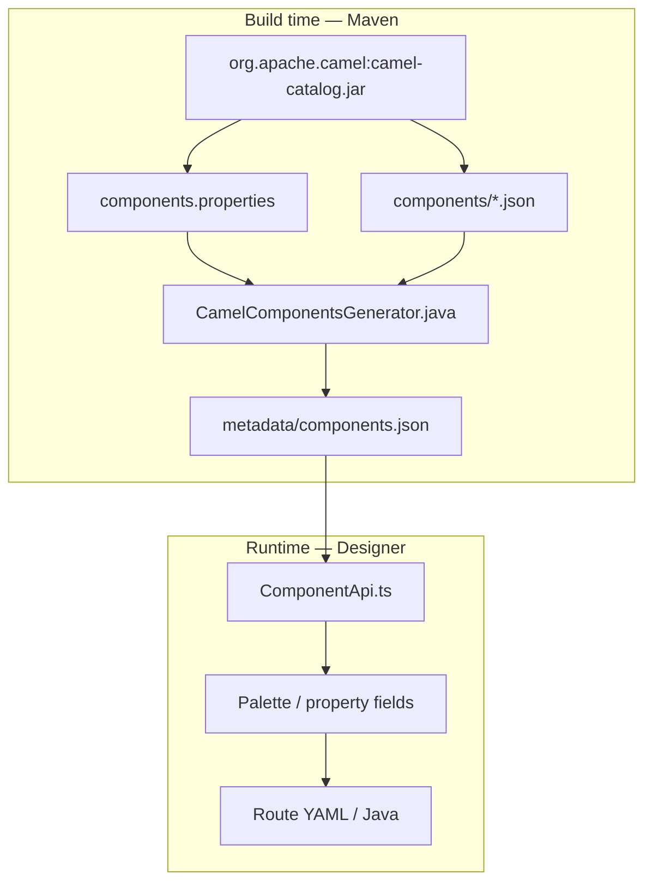

# FlowCamel × Apache Karavan — Camel Catalog Plan

This document is the **implementation plan** for aligning FlowCamel with **Apache Karavan’s Camel component catalog** model.

**In scope:** `org.apache.camel:camel-catalog` from Maven, SOURCE / ACTION / DESTINATION roles, Java DSL ZIP generation.

**Out of scope:** Kamelets, `camel-kamelets-catalog`, Kamelet YAML routes.

---

## 1. How Karavan works (reference)



| Karavan piece | Role |
|---------------|------|
| **Maven `camel-catalog`** | Single source of truth for all components |
| **`components.properties`** | List of component names in the JAR |
| **`components/{name}.json`** | Metadata: `consumerOnly`, `producerOnly`, `syntax`, `properties`, `artifactId` |
| **`CamelComponentsGenerator`** | Extract JAR → `components.json`; strip `componentProperties`; skip deprecated + `kamelet` |
| **`ComponentApi`** | Load catalog; parse URI from `syntax`; consumer vs producer property groups |
| **`supported-components.json`** | Optional allowlist / support level (Stable, Preview, …) |
| **Designer** | Pick component → configure from catalog properties → emit route DSL |
| **Generator / JBang** | Resolve Maven deps from components used in routes |

Karavan does **not** hand-write 300 `camelUri` templates. It uses **catalog `syntax` + `properties`** and runtime URI parsing (`ComponentApi.getUriParts`, etc.).

---

## 2. FlowCamel target architecture (Karavan-aligned)

```mermaid
flowchart TB
  subgraph sync [Build time — pnpm catalog:sync]
    MVN["camel-catalog-4.5.0.jar"]
    SCRIPT["scripts/sync-camel-catalog.mjs"]
    COMP["catalog/camel/components.json"]
    VER["catalog/camel/version.json"]
    MVN --> SCRIPT
    SCRIPT --> COMP
    SCRIPT --> VER
  end

  subgraph core [@flowcamel/core]
    BLOCKS["blocks.json — featured palette + wizard UX"]
    EIPS["eips.json — ACTION steps"]
    REG["CatalogRegistry.ts"]
    URI["UriBuilder.ts"]
    DSL["RouteDsl.ts"]
    COMP --> REG
    BLOCKS --> REG
    EIPS --> DSL
    REG --> URI
  end

  subgraph app [App]
    DES["Designer — BlockPanel, WizardPanel"]
    GEN["@flowcamel/generator — ZIP"]
    REG --> DES
    URI --> GEN
    DSL --> GEN
  end
```

**Two layers (same idea as Karavan “catalog + curation”):**

| Layer | File | Purpose |
|-------|------|---------|
| **Machine** | `components.json` (from Maven) | Full Camel 4.5 catalog — schemes, flags, properties, Maven coords |
| **Human** | `blocks.json` + `eips.json` | Featured palette, plain-English wizard (`q`, `help`), EIP DSL mapping |

---

## 3. Role model (SOURCE / ACTION / DESTINATION)

Aligned with Karavan consumer/producer semantics (no Kamelet roles).

| Catalog flags | FlowCamel role | DSL |
|---------------|----------------|-----|
| `consumerOnly: true` | **SOURCE** | `from("uri")` |
| `producerOnly: true` | **DESTINATION** | `.to("uri")` |
| Both `false` | **SOURCE** or **DESTINATION** (chosen when placing block; store `role` on node) | `from` / `to` |
| EIP registry (`eips.json`) | **ACTION** | `.filter`, `.log`, `.marshal`, … |

**Validation (same rules as today, catalog-aware later):**

- Exactly one source path; destinations have no outgoing edges; sources have no incoming edges.
- No cycles.
- Required catalog properties filled before generate (future).

---

## 4. Parity matrix

| Capability | Karavan | FlowCamel now | Target |
|------------|---------|---------------|--------|
| Catalog from Maven JAR | ✅ | ✅ `pnpm catalog:sync` | ✅ |
| `components.json` bundle | ✅ | ✅ ~339 components | ✅ |
| Strip `componentProperties` | ✅ | ✅ | ✅ |
| Exclude deprecated / kamelet | ✅ | ✅ | ✅ |
| Version pin = runtime Camel | ✅ | ✅ 4.5.0 | ✅ |
| Full palette from catalog | ✅ | ✅ featured via `supported-components.json` | ✅ |
| Property UI from catalog fields | ✅ | ✅ ConfigModal + `CatalogPropertyField` | ✅ |
| URI build from `syntax` + properties | ✅ | ✅ catalog first, template fallback | ✅ |
| `ComponentApi`-style URI parse | ✅ | ✅ `ComponentUri.ts` | ✅ |
| Supported / blocked components list | ✅ | ✅ `PaletteRegistry` | ✅ |
| POM deps from catalog `artifactId` | ✅ | ✅ `getMavenStarter()` | ✅ |
| Java DSL route generation | ✅ | ✅ `RouteDsl.ts` | ✅ extend EIP |
| YAML DSL export (plain routes) | ✅ | ✅ `graphToYamlRoutes` in Generate ZIP (`routes.camel.yaml`) | ✅ |
| Integration CRD export | ✅ | ⬜ | Optional later |
| Kamelets | ✅ | ❌ excluded | ❌ |

Legend: ✅ done · 🔶 in progress · ⬜ not started

---

## 5. Implementation phases

### Phase 0 — Catalog from Maven ✅ (done)

**Goal:** Same artifact and extraction rules as Karavan.

| Task | Status |
|------|--------|
| `scripts/sync-camel-catalog.mjs` downloads `org.apache.camel:camel-catalog:4.5.0` | ✅ |
| Extract `components.properties` + `components/*.json` | ✅ |
| Filter deprecated + `kamelet`; remove `componentProperties` | ✅ |
| Write `packages/core/src/catalog/camel/components.json` | ✅ |
| `CatalogRegistry` — lookup by scheme/name, roles, Maven starter | ✅ |
| `pnpm catalog:sync` at root + `@flowcamel/core` | ✅ |
| Document in `catalog/camel/README.md`, `HANDOVER.md` | ✅ |

**Verify:**

```bash
pnpm catalog:sync
pnpm --filter @flowcamel/core build
```

---

### Phase 1 — Catalog-backed generation ✅ (done)

**Goal:** Generator uses catalog for dependencies; URIs still from curated templates.

| Task | Status |
|------|--------|
| `getMavenStarter(blockType)` from catalog `artifactId` | ✅ |
| `UriBuilder` / `buildEndpointUri()` from `blocks.json` `camelUri` | ✅ |
| `RouteDsl.ts` + `eips.json` for ACTION steps | ✅ |
| `blocks.json` — `scheme` on each SOURCE/DESTINATION block | ✅ |
| Remove hardcoded `COMPONENT_ARTIFACT_MAP` in `PomBuilder` | ✅ |

**Verify:** Generate ZIP for a flow with kafka + jdbc; `pom.xml` contains `camel-kafka-starter`, `camel-jdbc-starter`.

---

### Phase 2 — Karavan-style property panel (catalog-driven UI) ✅

**Goal:** Configure nodes from catalog `properties` (like `ComponentPropertyField.tsx`), with optional wizard overlay.

| Task | Status |
|------|--------|
| Add `ComponentProperty` model (mirror Karavan fields: `kind`, `group`, `secret`, `enum`) | ✅ |
| Generic `CatalogPropertyField` renderer in designer | ✅ |
| Wizard: curated steps from `blocks.json` via `getWizardSteps()` | ✅ |
| `ConfigModal`: overlay + catalog props via `getConfigPropertiesForBlock()` | ✅ |
| Split props by `label` group: `consumer` vs `producer` (Karavan `getComponentProperties`) | ✅ |

**Files to touch:**

- `packages/designer/src/panel/WizardPanel.tsx`
- `packages/designer/src/panel/PropertyPanel.tsx`
- `packages/app/frontend/src/features/project/ConfigModal.tsx`
- New: `packages/designer/src/panel/CatalogPropertyField.tsx`

---

### Phase 3 — Karavan-style URI builder ✅

**Goal:** Build endpoint URIs from catalog `syntax` + path/query properties, with template fallback for complex URIs (e.g. FTP credentials).

| Task | Status |
|------|--------|
| Port URI helpers: `parseSyntax`, `getUriParts`, `getSyntaxSeparators` (from Karavan `ComponentApi`) | ✅ |
| `buildUriFromCatalog(scheme, role, props)` in `ComponentUri.ts` | ✅ |
| `buildEndpointUri()` — catalog first, `camelUri` template fallback | ✅ |
| Per-scheme workarounds (salesforce, cxf, jt400) | ✅ |
| `splitEndpointUri` / `buildEndpointDescriptor` for YAML | ✅ |
| Plain YAML export + `validateForYamlExport` | ✅ |
| Snapshot tests: 18 MVP blocks | 🔶 basic vitest |
| Deprecate `camelUri` in `blocks.json` | ⬜ |

**Node model change:**

```ts
interface FlowNode {
  id: string;
  blockType: string;       // featured id, e.g. kafka-source
  scheme?: string;           // catalog scheme, e.g. kafka
  role?: 'consumer' | 'producer';
  label: string;
  props: Record<string, string>;
  position: { x: number; y: number };
}
```

---

### Phase 4 — Palette & supported components ✅

**Goal:** Browse catalog like Karavan; restrict what appears in the sidebar.

| Task | Status |
|------|--------|
| `supported-components.json` — featured block types | ✅ |
| `blocked-components.json` — scheme denylist | ✅ |
| BlockPanel: `getFeaturedBlocks()` + catalog title in tooltip | ✅ |
| Search by label / short text | ✅ |
| “Add component” flow for dual-role schemes | ⬜ |
| `GET /api/catalog/meta` | ✅ |

---

### Phase 5 — EIP catalog expansion

**Goal:** ACTION steps match Karavan EIP palette (still no Kamelets).

| EIP | FlowCamel block | DSL |
|-----|-----------------|-----|
| Filter | `filter-action` | `.filter(simple(...))` |
| Log | `log-action` | `.log(...)` |
| Transform | `transform-action` | `.transform()...` |
| Split | `split-action` | `.split(...)` |
| Marshal / Unmarshal | ⬜ new | `.marshal().json()` etc. |
| Choice | ⬜ future | `.choice()...` (needs branch UI) |
| To (component) | rest-call, destinations | `.to("uri")` |

| Task | Status |
|------|--------|
| Extend `eips.json` + `RouteDsl` emitters for common EIP | ⬜ |
| Optional: load EIP list from catalog processors (separate sync) | ⬜ |

---

### Phase 6 — Quality & ops

| Task | Status |
|------|--------|
| CI job: `pnpm catalog:sync` + diff check (or commit hash in `version.json`) | ⬜ |
| Golden tests: graph → `GeneratedRouteBuilder.java` / `pom.xml` | ⬜ |
| `application.yml` from Spring Boot + catalog (replace naive prop dump) | ⬜ |
| Catalog API: `GET /api/catalog/components?featured=true` (avoid 5.8MB in browser bundle) | ⬜ optional |

---

## 6. File map

| Path | Karavan equivalent | Status |
|------|-------------------|--------|
| `scripts/sync-camel-catalog.mjs` | `CamelComponentsGenerator.java` | ✅ |
| `packages/core/src/catalog/camel/components.json` | `metadata/components.json` | ✅ |
| `packages/core/src/catalog/camel/version.json` | — | ✅ |
| `packages/core/src/api/CatalogRegistry.ts` | `ComponentApi.ts` (subset) | ✅ partial |
| `packages/core/src/api/UriBuilder.ts` | `ComponentApi.getUriParts` | ✅ partial |
| `packages/core/src/api/RouteDsl.ts` | route emitter | ✅ |
| `packages/core/src/catalog/blocks.json` | featured palette + UX | ✅ |
| `packages/core/src/catalog/eips.json` | EIP steps | ✅ |
| `packages/generator/src/builders/PomBuilder.ts` | dependency resolution | ✅ |
| `docs/CATALOG_PLAN.md` | — | ✅ this file |

---

## 7. Version alignment checklist

When bumping Camel (e.g. 4.5.0 → 4.6.0):

1. `packages/generator/src/templates/pom.xml.hbs` → `camel.version`
2. `scripts/sync-camel-catalog.mjs` → `CAMEL_VERSION`
3. Run `pnpm catalog:sync`
4. Run golden generate tests
5. Commit updated `components.json` + `version.json`

---

## 8. Product decisions (locked)

| Decision | Choice |
|----------|--------|
| Catalog source | Maven `camel-catalog` only (same as Karavan) |
| Kamelets | **No** |
| MVP output DSL | **Java** (Spring Boot route builder) |
| Palette | Start **featured** (`blocks.json`); expand via Phase 4 |
| Dual-role components (http, kafka) | Separate block types today (`kafka-source` / `kafka-dest`); optional unified picker in Phase 4 |
| Wizard UX | Keep plain-English overlay on top of catalog fields |

---

## 9. Suggested order of work

```
Phase 0 ✅ → Phase 1 ✅ → Phase 2 (property UI) → Phase 3 (URI builder)
    → Phase 4 (palette) → Phase 5 (EIP) → Phase 6 (CI/tests)
```

**Next recommended slice:** Phase 5 (EIP expansion) or Phase 6 (CI + golden tests + optional AJV schema validation on generated YAML).

---

## 10. References

- [Apache Karavan — `CamelComponentsGenerator.java`](https://github.com/apache/camel-karavan/blob/main/karavan-generator/src/main/java/org/apache/camel/karavan/generator/CamelComponentsGenerator.java)
- [Karavan — `ComponentApi.ts`](https://github.com/apache/camel-karavan/blob/main/karavan-core/src/core/api/ComponentApi.ts)
- [Camel catalog Maven artifact](https://repo1.maven.org/maven2/org/apache/camel/camel-catalog/)
- FlowCamel: `HANDOVER.md`, `packages/core/src/catalog/camel/README.md`
